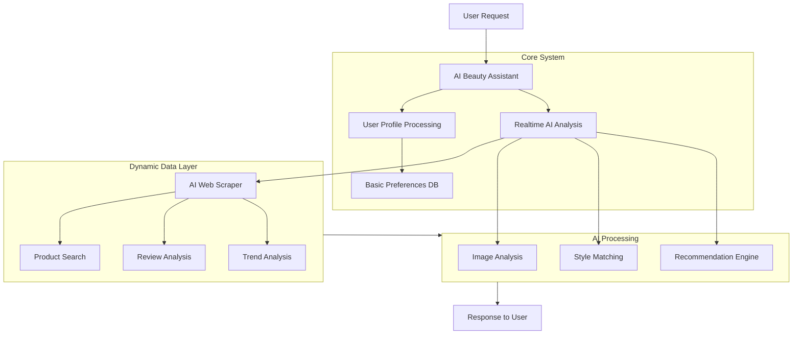

# Yara: AI Beauty Agent 🌟

**Yara** is an intelligent AI-powered beauty assistant that provides personalized beauty recommendations, product suggestions, and style guidance in real-time. Using advanced AI and real-time data analysis, Yara serves as your personal beauty expert, understanding your unique features and preferences to deliver tailored recommendations.

~ _Developed by Perfect3sixty_



## Development

```bash
python -m venv .venv

source .venv/Scripts/activate 
# or
source .venv/bin/activate

pip install -r requirements.txt

uvicorn main:app --reload --port 7600
```


## Contributing

1. Fork the repository
2. Create your feature branch (`git checkout -b feature/AmazingFeature`)
3. Commit your changes (`git commit -m 'Add some AmazingFeature'`)
4. Push to the branch (`git push origin feature/AmazingFeature`)
5. Open a Pull Request

## License

Distributed under the MIT License. See `LICENSE` for more information.

## Contact

Perfect3sixty - [@perfect3sixty](https://twitter.com/perfect3sixty)

Project Link: [https://github.com/perfect3sixty/yara](https://github.com/perfect3sixty/yara)

## Acknowledgments

- OpenAI for AI capabilities
